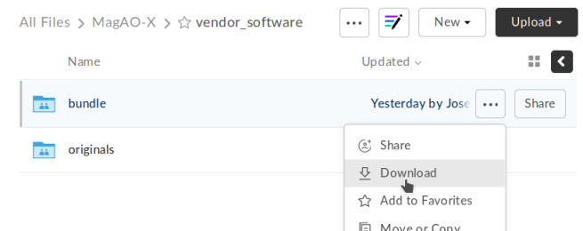

# Instrument computer setup guide

```eval_rst
.. toctree::
    :hidden:

    controller_os_setup
    workstation_os_setup
```

The setup process for the instrument computers (ICC, RTC, AOC) is automated (to the extent possible) by scripts in the [`setup/`](https://github.com/magao-x/MagAOX/tree/master/setup) folder of [magao-x/MagAOX](https://github.com/magao-x/MagAOX).

Unfortunately, not _everything_ can be automated when real hardware is involved. To set up a new instrument computer, follow the steps below. Once the BIOS and OS are setup, you can [run the provisioning scripts](#run-provisioning-scripts).

## Real Time control Computer (RTC) and Instrument Control Computer (ICC)

Follow the steps in [Controller operating system setup](controller_os_setup.md) from BIOS configuration through OS install and first boot.

## Adaptive optics Operator Computer (AOC)

Follow the steps in [Workstation operating system setup](workstation_os_setup.md) from BIOS configuration through OS install and first boot.

## Perform (mostly) automated provisioning

Log in via `ssh` as a normal user with `sudo` access.

1. Clone [magao-x/MagAOX](https://github.com/magao-x/MagAOX) into your home directory (**not** into `/opt/MagAOX`, yet)

   ```
   $ cd
   $ git clone https://github.com/magao-x/MagAOX.git
   ```

2. Switch to the `setup` subdirectory in the MagAOX directory you cloned (in this example: `~/MagAOX/setup`) to perform pre-provisioning steps (i.e. steps requiring a reboot to take effect)

    ```
    $ cd ~/MagAOX/setup
    $ ./pre_provision.sh
    ```

    This sets up an `xsup` user and the `magaox` and `magaox-dev` groups. Because this step adds whoever ran it to `magaox-dev`, you will have to **log out and back in**.

    **RTC/ICC only:** This step installs the CentOS realtime kernel and updates the kernel command line for ALPAO compatibility reasons. You must reboot before continuing.

3. Reboot, verify groups

    ```
    $ sudo reboot
    [log in again]
    $ groups
    yourname magaox-dev ...
    ```

4. *(optional)* Install `tmux` for convenience

    `tmux` allows you to preserve a running session across ssh disconnection and reconnection. (Ten second tutorial: Running `tmux` with no arguments starts a new self-contained session. `Ctrl-b` followed by `d` detatches from it, while any scripts you started continue to run. The `tmux attach` command reattaches.)

    **On RTC/ICC:**
    ```
    $ sudo yum install -y tmux
    ```

    **On AOC:**
    ```
    $ sudo apt install -y tmux
    ```

    (It's used by the system, so it'll get installed anyway, but you might want it when you run the install.)

    To start a new session for the installation:

    ```
    $ tmux
    ```

5. **RTC/ICC only:** Obtain proprietary / non-redistributable software from the team Box folder

    Go to [MagAO-X/vendor_software/](https://arizona.box.com/s/dhmxrhjv00yh8lz4m0j7meivfaoyn9cn) _(invite required)_, click the "..." on `bundle` and choose "Download". Save `bundle.zip` in `MagAOX/setup/` next to `provision.sh`.

    

    This bundle includes software for the Andor, ALPAO, and Boston Micromachines hardware.

6. Run the provisioning script as a normal user

    ```
    $ cd ~/MagAOX/setup
    $ bash ./provision.sh
    ```

    If you installed and invoked `tmux` in the previous step, this would be a good time to `Ctrl-b` + `d` and go get a coffee.

Successful provisioning will end with the message "Finished!" and installed copies of MagAOX and its dependencies.

A lot of the things this script installs need environment variables set, so `source /etc/profile.d/*.sh` to keep working in the same terminal (or just log in again).

## Perform `xsup` key management

A new installation will generate new SSH keys for `xsup`. If you have an existing `.ssh` folder for the machine role (ICC, RTC, AOC) you're setting up, you can just copy its contents over the new `/home/xsup/.ssh/` (taking care not to change permissions).

If not, you must ensure passwordless SSH works bidirectionally by installing other servers' `xsup` keys and installing your own in their `/home/xsup/.ssh/authorized_keys`.

In the guide below, `$NEW_ROLE` is the role we just set up and `$OTHER_ROLE` is each of the other roles in turn. (For example, if we just set up the RTC, `$NEW_ROLE == RTC` and `$OTHER_ROLE` would be ICC and AOC.)

### Step-by-step

For each of the `$OTHER_ROLE`s:

1. On `$NEW_ROLE`, copy `/home/xsup/.ssh/id_ed25519.pub` to the clipboard
2. Connect to `$OTHER_ROLE` with your normal user account over SSH
3. Become `xsup` on `$OTHER_ROLE` and edit `/home/xsup/.ssh/authorized_keys` to insert the one you copied
4. On `$OTHER_ROLE`, copy `/home/xsup/.ssh/id_ed25519.pub` to the clipboard
5. Back on `$NEW_ROLE`, append the key you just copied to `/home/xsup/.ssh/authorized_keys`
6. On `$NEW_ROLE`, test you can `ssh $OTHER_ROLE` as `xsup` (potentially amending `~/.ssh/known_hosts`)
7. On `$OTHER_ROLE`, test you can `ssh $NEW_ROLE` as `xsup` (potentially amending `~/.ssh/known_hosts`)
