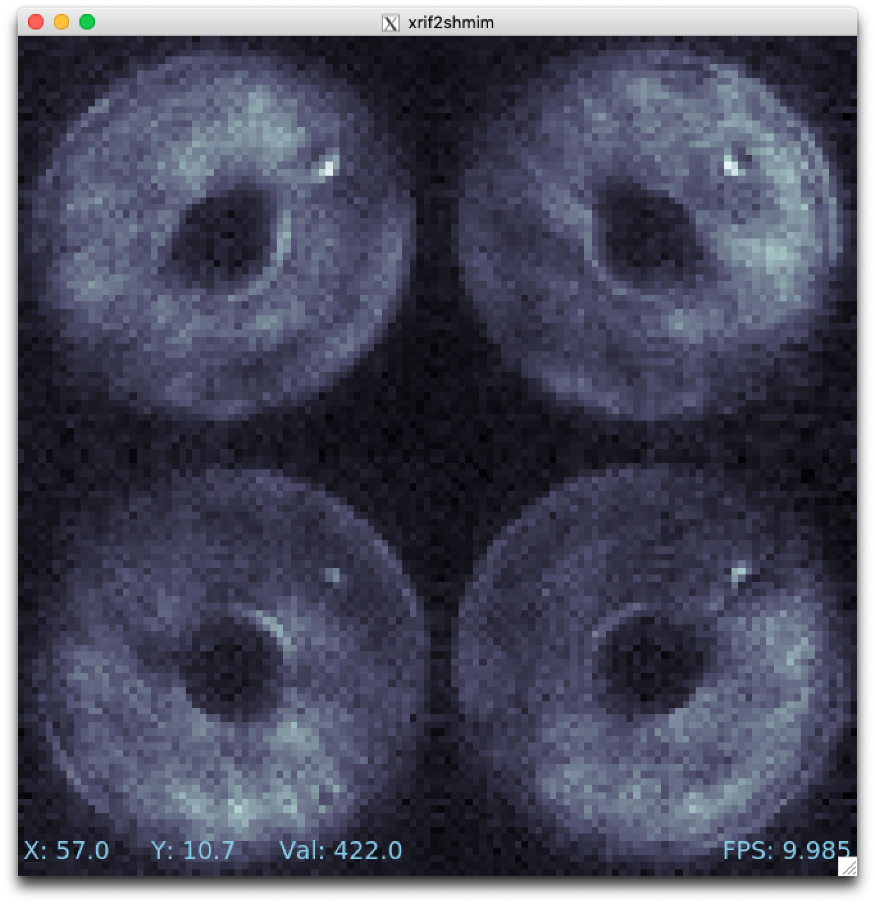

# Developing in a virtual machine

The MagAO-X software is designed for use on Linux with CentOS 7 and Ubuntu 18.04, and the included [provisioning script](https://github.com/magao-x/MagAOX/blob/master/setup/provision.sh) will automatically set up a fresh install on these operating systems (OSes).

If you're on a Mac or Windows machine, or if you just want to keep MagAO-X isolated from the rest of your OS, you should use a virtual machine (VM). A virtual machine is a simulated computer (running whatever "guest OS" you like) that runs as a program on your computer's OS (which we call the "host OS").

Conceptually, you just create a virtual CentOS or Ubuntu computer and go through the normal installation process on it. To automate this process, and make certain customizations for speed and convenience, there's [Vagrant](https://www.vagrantup.com/). Vagrant can start a virtual machine from a pre-made image, run your install script, and configure things like forwarding network ports from the VM to your host OS.

As it happens, MagAO-X has a [Vagrantfile](https://github.com/magao-x/MagAOX/blob/master/Vagrantfile) that defines two VM configurations, `AOC` (Ubuntu 18.04, the default) and `ICC` (CentOS 7).

## Prerequisites

  * `git` — Preinstalled on most Linuxes, install with `xcode-select --install` on macOS, see [below](#additional-notes-for-windows-users) for Windows
  * [VirtualBox](https://www.virtualbox.org/) — Preferred virtualization backend, available for free
  * [Vagrant](https://www.vagrantup.com/) — Program to automate creation / provisioning of development VMs
  * NFS — available preinstalled on macOS and most Linux hosts *(ICC guest on macOS and Linux hosts only)*

### Additional notes for Windows users

  1. It's probably easiest to get `git` from [Anaconda]() if you're already using it (use `conda install git` at the Anaconda command line)
  2. `git` needs to be configured not to alter line endings. After installing git, you should do `git config --global core.autocrlf false` *before* cloning MagAOX. (However, if you use `git` for other things, you may not want this to be a global setting.)
  3. The section below on [Using GUIs in the VM](#Using-GUIs-in-the-VM) needs to be expanded with instructions for Windows. (Basically, we need to figure out which of the X11 servers for Windows works with `vagrant ssh` in the current configuration.) Until then, no GUIs in Windows.

## Setup

1. Ensure `vagrant` command is available:

    ```text
    $ vagrant --help
    Usage: vagrant [options] <command> [<args>]
    ...
    ```
2. Clone [magao-x/MagAOX](https://github.com/magao-x/MagAOX) (if necessary) and `cd` into MagAOX

    ```text
    $ git clone https://github.com/magao-x/MagAOX.git
    Cloning into 'MagAOX'...
    ...

    $ cd MagAOX
    ```

3. Run `vagrant up` (or `vagrant up ICC`)

    ```text
    $ vagrant up
    ```

    If prompted, enter your password to configure NFS exports. (See [this doc](https://www.vagrantup.com/docs/synced-folders/nfs.html#root-privilege-requirement) for information on eliminating that prompt.)

    **Note:** The `vagrant up` step is CPU and bandwidth intensive the first time, as it will download an OS image and all of the MagAO-X dependencies, then compile them. Subsequent `vagrant up`s will just boot the existing machine.

Don't be alarmed by the output from `vagrant up`. Provisioning is very noisy, and messages in red aren't necessarily errors. Successful provisioning will end with the message

```
Provisioning complete
```

## Usage

### Connecting

To connect to the VM, use `vagrant ssh`. You'll be logged in as user `vagrant` with no password. The rest of the commands in this section are to be run in a `vagrant ssh` session, unless otherwise noted.

### Running MagAO-X

The `magaox` script is installed during provisioning, and a default set of (non-hardware-interfacing) apps is configured to run on `magaox startup`.

The proclist for VM usage is in [magao-x/config/proclist_vm.txt](https://github.com/magao-x/config/blob/master/proclist_vm.txt).

Once `magaox startup` finishes, you can use `getINDI` to see the current set of properties from the INDI drivers started in the VM.

Try it and see:

```text
$ magaox startup

Session isVM does not exist
Created tmux session 'isVM'
Executed in isVM session: /opt/MagAOX/bin/xindiserver -n isVM
Waiting 5 seconds for xindiserver...
...

$ getINDI

maths_y.fsm.state=READY
maths_y.maths.abs=0
maths_y.maths.prod=0
maths_y.maths.sqr=0
...
```

### Network access

Aside from SSH, which is usually accomplished with `vagrant ssh` on the host (see [their docs](https://www.vagrantup.com/docs/cli/ssh.html)), there is also access to the VM on these ports:

  * 7624 — INDI
  * 8080 — HTTP (reserved for web UI, maps to guest port 80)
  * 9999 — HTTP (JupyterLab)

These ports on `localhost` in the host OS are forwarded to their counterparts on the guest VM. (In other words, to connect to the INDI server on the VM port 7624, you connect to `localhost:7624` on the host OS.)

### JupyterLab

The VM automatically starts a JupyterLab instance on port 9999, running as the `vagrant` user. So, to quickly run Python code in the VM, open a browser in your host OS and enter `http://localhost:9999`. (The password is `extremeAO!`.)

This JupyterLab instance runs in the `py37` conda environment created from the recipe in [conda_env_py37.yml](https://github.com/magao-x/config/blob/master/conda_env_py37.yml) and instructions in [create_conda_envs.sh](https://github.com/magao-x/MagAOX/blob/master/setup/steps/create_conda_envs.sh). So, you should have packages like `purepyindi` and `ImageStreamIOWrap` already. (If you need a package that's not there, `sudo -i conda install NameOfPackage` should fix it. Note the `-i`!)

### Using GUIs in the VM

The VM is configured to be "headless", meaning there's no graphical display window. However, we can still build and run MagAO-X GUIs as long as your host OS has an X11 server (most Linux systems do by default, but you will need [XQuartz](https://www.xquartz.org/) on macOS).

If you're unfamiliar with SSH X forwarding, the short version is that the app runs on the VM but the window pops up like any other window on your own computer (the host). SSH (i.e. `vagrant ssh`) is the transport that moves information about the window back and forth to the GUI app, which is still running inside the VM.

```text
+------------------------------------------+
|                  +----------------------+|
|    Host OS       |          VM          ||
|                  |                      ||
|  [GUI window] <-SSH-> [MagAO-X GUI app] ||
|                  +----------------------+|
+------------------------------------------+
```

So, to start the `pwr` GUI, you could do...

```
host$ vagrant ssh
vm$ cd /opt/MagAOX/source/MagAOX/gui/apps/pwr
vm$ make
vm$ ./bin/pwr
```

...and the power GUI will come up like any other window on your host machine.

The additional dependencies of the GUIs are tracked in [magao-x/MagAOX/setup/steps/install_gui_dependencies.sh](https://github.com/magao-x/MagAOX/blob/master/setup/steps/install_gui_dependencies.sh) for both CentOS and Ubuntu, and are installed automatically when you provision the VM. (Something missing? Add the package name to the script and run `vagrant provision` from the host!)


### Simulating image data streams

In operation, MagAO-X uses shared memory buffers (shared memory images, or 'shmims') to relay image data between different parts of the system. (This includes things like detector images, which you probably expected, but also things like DM commands, which you might not.)

The MagAO-X system software then streams these images to disk as as `xrif` files. The `.xrif` format is internal to MagAO-X, and was developed as a compromise between speed of write-out and compression ratio. It's possible to play back an `xrif` file into a shmim to simulate a real instrument image data stream using the `xrif2shmim` utility.

Start by grabbing an example xrif file like `camwfs_20190904220756666636000.xrif` from Box under `MagAO-X/example_data/` and save it somewhere on your host machine. To make it available in the VM, copy it into the folder where you cloned `MagAOX`. For example, if you cloned MagAOX to `~/devel/MagAOX/` on the host, copy the xrif to `~/devel/MagAOX/camwfs_20190904220756666636000.xrif`.

Now, in your `vagrant ssh` session:

```text
$ xrif2shmim /vagrant/camwfs_20190904220756666636000.xrif &
```

This creates a shmim called `xrif2shmim` that plays back the contents of `/vagrant/camwfs_20190904220756666636000.xrif` on a loop. (The `&` places the stream reader in the background.)

To see what it's doing, you can use the `rtimv` image viewer installed in the VM:

```text
$ rtimv xrif2shmim
```

You should see something like this:



### Developing MagAO-X

 The VM has a view of your copy of this repository under `/vagrant`. For example, no matter where you cloned this repository on your own (host) machine, the virtual machine will see this file at `/vagrant/README.md`. (For consistency with production, we symlink `/opt/MagAOX/source/MagAOX` to `/vagrant`.) Edits to the MagAO-X software source on your computer will be instantly reflected on the VM side, ready for you to `make` or `make install` in your ssh session.

There are some other paths under `/opt/MagAOX` that are also symlinked to the host:

  * `/opt/MagAOX/.cache -> /vagrant/setup/cache`
  * `/opt/MagAOX/calib -> /vagrant/setup/calib`
  * `/opt/MagAOX/config -> /vagrant/setup/config`

In other words, if you cloned from GitHub into `/home/me/devel/MagAOX`, the copy of the MagAO-X config files used by your VM would be in `/home/me/devel/MagAOX/setup/config`. (**Unlike** like the real instrument.)

The `vagrant` user you log in as with `vagrant ssh` will be a member of the `magaox` and `magaox-dev` groups following successful provisioning, and should have all the necessary permissions to run the system (or, at least, the parts you can run in a VM).

### Advanced usage

The `ICC` and `AOC` configurations in the Vagrantfile are mutually exclusive (i.e. map the same ports). Switching between the `ICC` and `AOC` configurations is not recommended, as you must `make all_clean` and ensure there are no binaries built with Ubuntu's toolchain present when CentOS boots up and vice-versa.

If you want both, the easiest way is to just clone another copy of the MagAO-X repository and `cd newMagAOX/ && vagrant up ICC` (or `AOC`) in there. (Note that you can copy or symlink the `setup/cache/`, `setup/calib/`, and `setup/config/` folders to avoid having too many redundant copies of things.)
