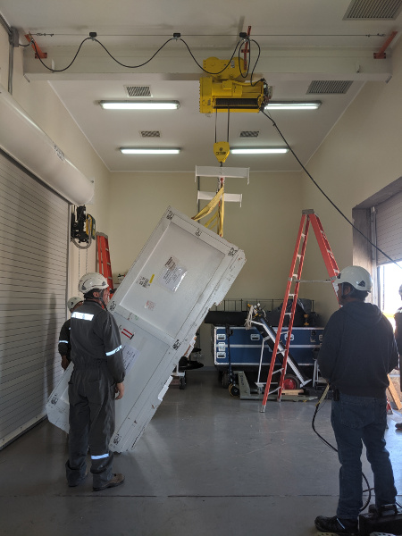
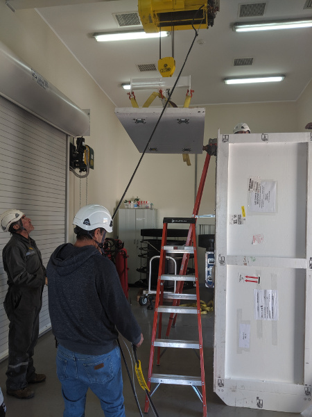
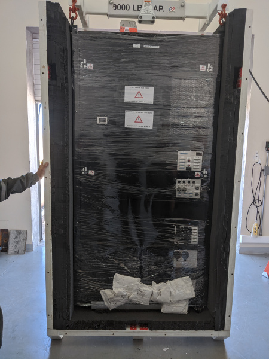
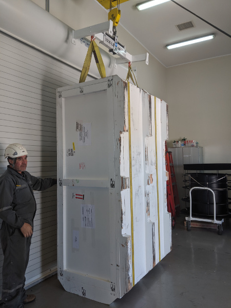
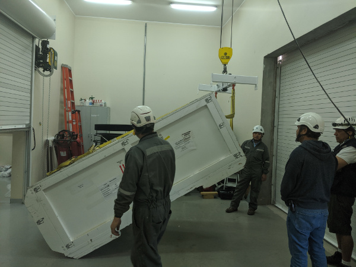

# Packing the MagAO-X Electronics at LCO

This procedure describes how to pack the MagAO-X electronics rack at LCO.

Estimate Time to Complete:  2 hrs

This document can be dowloaded as pdf:

```eval_rst
:download:`Electronics Rack Packing at LCO <electronics_packing.pdf>`
```

## Initial Conditions

- [ ] Electronics rack removed from telescope and in clean room
- [ ] Electronics off, and unplugged

## Preparations

- [ ] Remove the UPS and stow for next time

- [ ] Drain glycol from the facility side loop, and blow it out.

- [ ] Disconnect the liquid-liquid Hx, and then blow glycol out from the instrument side loop.

- [ ] Use a wet-vac to remove glycol from the liquid-liquid Hx.

- [ ] Check that all components are secure and shelves are restrained.

- [ ] Ensure that the side panels are tightly fasteneded

- [ ] Close and lock the doors

- [ ] Tape the keys down

- [ ] Install dessicant inside the rack, make sure it is secure

- [ ] Shrink wrap the rack

## Prepare Box For Loading

- [ ] Install and bolt on the Lid and end-piece with lifting eyes

- [ ] Install the T-ended lifting fixture extensions

- [ ] Raise the lifting fixture with the crane, and attach it to the box end with two short straps in double pass.


<br />*Attaching the lifting fixture for lifting the box.  Note that the staps are in double pass to be short enough.*


- [ ] Begin lifting the box into loading position with the crane.


<br />*The electronicx box being lifted into loading position*

- [ ] As the box lifts, move the crane forward so that it is pivoting the box on the diagonal skid.

- [ ] When the box is upright, remove the lid (now a side) and the end-piece (now the top).  Remove the end piece form the crane.


<br />*The electronicx box end-piece is removed and set aside*


- [ ] Place the top foam to the side.

## Load the Electronics Box

- [ ] Attach the lifting fixture to the rack lifting eyes with 2 shackles as shown below.


<br />*The electronicx box rack being lifted.*

- [ ] Lift the rack and move the crane to place the rack in the box.  The side with the instrument cables should be facing out so it is on top when the box is layed down. 2 people will be needed to guide the rack into the foam.



<br />*The electronicx box rack in the shipping box.*

<b> NOTE: Leave the rack attached to and supported by the crane until the lid (currently a side) is installed.  This is to prevent the rack from tipping out of the box. </b>


- [ ] Place the foam pieces over the side of the rack


<br />*The electronicx box foam top in place before the lid is installed.*

- [ ] Install the lid (currently a side) and bolt on

- [ ] Use the crane to attach the end-piece (currently the top)

- [ ] Wrap 2x ratchet straps around the box as shown.

## Lower The Box Into Shipping Position


<br />*Tightly wrap the box with ratchet straps to provide extra support.*

- [ ] If necessary reposition using a pallet jack.

<b> NOTE: DO NOT LIFT THE BOX WITH THE CRANE WITH THE RACK INSIDE </b>


<br />*Reposition the box with a pallet jack. <b> DO NOT LIFT WITH CRANE</b>*

- [ ] Using the crane for support begin tipping the box, conducting the reverse of the lifting process shown above.

- [ ] Move the crane so as to slowly lower the box.


<br />*Lowering the electronics box.*

- [ ] Once the box is on the skid, remove the ratchet straps

- [ ] Verify all bolts installed, and inspection ports securely installed.

- [ ] Move box to parking lot and stage for pickup.

