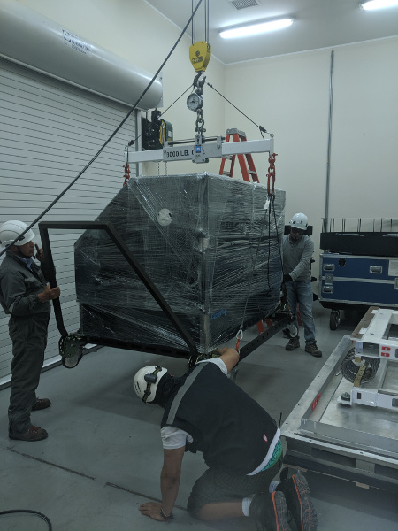
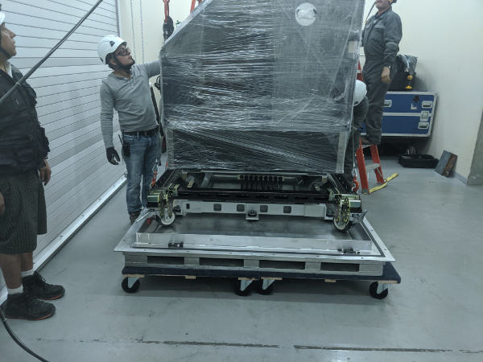

# Packing the MagAO-X Table at LCO for Shipment 

This procedure describes how to pack MagAO-X optical table for shipment.

Estimate Time to Complete:  2 hrs

This document can be dowloaded as pdf:

```eval_rst
:download:`MagAO-X Table Packing at LCO <instrument_packing.pdf>`
```

## Initial Conditions

- [ ] The optical table is in the cleanroom, on the handling cart, fully disconnected from the control electronics.

## Preparations

- [ ] Secure all optics for transport.

- [ ] Check that all components on table are securely fastened.

- [ ] Install dessicant.

- [ ] Shrink-wrap the instrument.

- [ ] Install the reflective blanket for solar shielding.

## Prepare the Box.

- [ ] Move the empty box and shipping frame into the unpacking room with the forklift, placing it on 4 furniture dollies.


<br />*The instrument box is brought to the unpacking area with the forklift.*


<br />*The instrument box being set down on dollies with the fork lift.  Note the placement and orientation of the dollies.*

- [ ] Move the box towards the inside garage door, and stage 4 more dollies to accept the lid.


<br />*Box in position to have the lid removed.*

- [ ] Remove the front panel from the box, place out of the way (e.g. outside).

- [ ] Remove all bolts holding the lid to the pallet

- [ ] Place the straight extension on the lifting fixture, and place it in the box-lid position.

- [ ] Attach the lifting fixture to the lid.  

- [ ] Lift the lid with the crane, and set it down on the dollies.


<br />*Box lid off, on dollies.*

- [ ] Move the pallet into the cleanroom to make room to maneuver the lid.

- [ ] Then move the lid out of the way, e.g. outside on the lift.

## Installing The Instrument On The Frame

- [ ] Move the pallet and frame towards the front of the unpacking room.

- [ ] Bring the instrument and cart out of the cleanroom.

<b> NOTE: position the cart so that the taller heavier side of the instrument will set down on the side of the frame with the most wire-rope isolators. </b>m

- [ ] Install the scale between the load spreader and the crane, and place the lifting fixture in the instrument+cart position.

- [ ] Install the triangle stabilizing rope ratchets, leaving them loose.


<br />*Preparation of the lifting fixture.*


- [ ] With the crane, carefully position the load spreader over the table.

<b> NOTE: be sure to guide both ends of the load spreader so it does not contact the instrumetn </b>

- [ ] Attach the load spreader to the cart.  Two shackles are used to extend the length.  The hooks should be placed opening up.


<br />*Use two shackles for correct length.*


<br />*Hooks must open up on the cart to get the correct length.*

- [ ] Lift the instrument+cart, which weigh <b>1920 lbs</b>, until all 4 wheels are off the ground.  If it is out of balance, it will be necessary to manually correct.


<br />*Lifting the instrument on its cart.*

- [ ] Adjust the load spread to find the best balance.

- [ ] Tighten the triangle stabilizing rope ratchets.

- [ ] With a person on each end stabilizing using the cart handles, lift the instrument to sufficient height to clear the shipping frame.

- [ ] Carefully roll the pallet and frame under the instrument

- [ ] Lower the instrument slowly to just touch the frame, but do not unload the crane.


<br />*The instrument on the frame.*

- [ ] While the instrumetn is still supported by the crane, start bolts at each corner to guid the instrument down.

- [ ] Lower the instrument until half the weight is off the crane.

- [ ] Start all bolts, including installation of the Emerson Clamp base plates.

- [ ] Fully lower the instrument, such that the crane is still supporting the cart weight of <b>320 lbs </b>

- [ ] Tighten all bolts holding the instrument to the shipping frame.


<br />*Tightening the bolts.*

- [ ] Remove the 8 bolts holding the cart to the table.

- [ ] Lower the cart so that it rests on the pallet.


<br />*The cart lowered onto the pallet.*

- [ ] Disassemble the cart, moving the pieces to storage area.

- [ ] Install the Emerson Clamps.

- [ ] Arm all drop-n-tells, and install the data loggers.

## Install the Lid and Door

- [ ] Move the pallet and instrument on the dollies back into the cleanroom to make space for the lid 

- [ ] Bring the lid back into the unpacking area and position it to be lifted on.  The open side goes towards the MagAO-X label on the instrument.

- [ ] Put the load spreader back in the position to balance the lid, and attach it with the crane to the lid.

- [ ] Lift the lid, and roll the instrument under the box.

- [ ] Set the lid down on the pallet


<br />*MagAO-X on the shipping frame inside the box.*

- [ ] Install the bolts along the bottom of the lid, securing it to the pallet.

- [ ] Bring the front door panel back inside, and lift it into position.

- [ ] Bolt the lid on.

- [ ] Remove the liffting eyes from the box lid and stow them on the lower left insspection panel.
