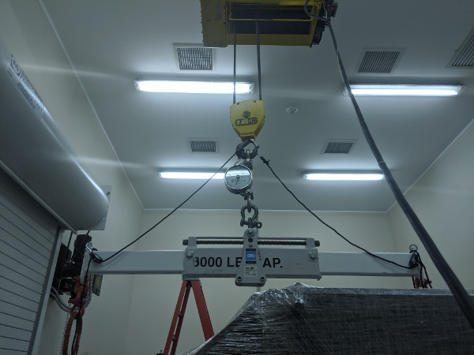
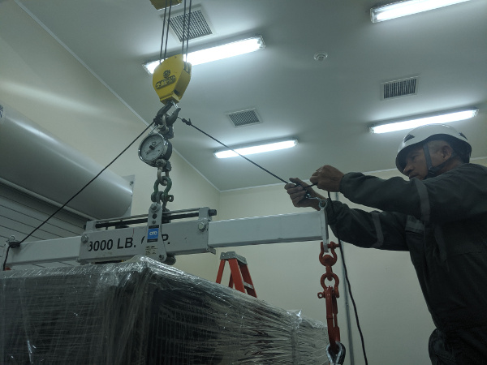
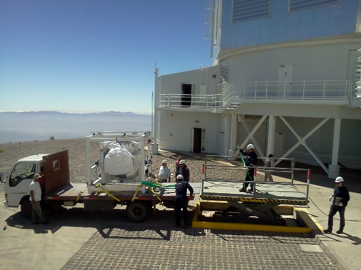

# Installing MagAO-X On The Telescope

This procedure describes how to install the MagAO-X instrument on the Magellan Clay Telescope.

Estimate Time to Complete: 5 hours

This document can be dowloaded as pdf:

```eval_rst
:download:`Telescope Installation Proecedure <telescope_install.pdf>`
```

## Initial Conditions

- [ ] Instrument in LCO cleanroom on legs

## Preparations

- [ ] Shutdown MagAO-X

- [ ] Turn off table legs and remove air connection

- [ ] Remove all cables
  - See detailed procedure for removing 2K DM cables

- [ ] Electronics Rack
  + [ ] Ensure that roll-out shelves are restrained
  + [ ] If not installed, Install side panels
  + [ ] Close and lock doors
  + [ ] Tape keys down 

- [ ] Instrument
  + [ ] Remove eyepiece
  + [ ] Turn off blower, and remove hose
  + [ ] Tape over any exposed holes (from cables, etc)
  + [ ] Secure any loose cables
  + [ ] Shrink wrap the instrument
  + [ ] Install solar blanked over shrink wrap

- [ ] Cart and Rigging
  + [ ] Verify all cart hardware is in-hand
  + [ ] Verify two wire harnesses are in hand
  + [ ] Partially assemble cart, leaving one long side off
  + [ ] Store card out of the way so table can roll into unpacking area

## Rig Onto Cart

- [ ] Lower table legs onto the casters by turning the 16 leveling bolts, and remove the metail pads

- [ ] Roll the instrument out of the cleanroom
 - [ ] At least 4 people required, 2 to push, 2 to hold the cleanroom sides open

- [ ] Continue rolling the instrument through the garage door into the unpacking area

- [ ] Move the cart, currently with 3 sides, around the legs
  - **CAUTION:** be careful to not bump the legs with the cart

- [ ] Attach the 4th side of the cart

- [ ] Ensure that the 8 large bolts on the cart are snug but not tight

- [ ] Attach the lifting wire-harnass to each side of the cart

- [ ] Attach the load spreader with straight extensions to the crane, using a crane scale


<br />*The load spreader attached to the crane for lifting the cart*

- [ ] Place the load spreader in the center position (the cart is symmetric)

- [ ] Lift the load spreader, and position it over the instrument

- [ ] Being careful to not bump the instrument, lower the loadd spreader and attach the lifting harnass D rings.  Use 2x shackles to extend the length to reach the cart on the floor.


<br />*Lifting harnasses attached with shackle extensions*

- [ ] Position a person at each corner of the cart

  **CAUTION:**  Do not allow the cart to bump the legs or the table uncontrolled

- [ ] Slowly lift the cart (**320 lbs**) until it is touching the bottom of the table


<br />*The cart being lifted to the bottom of the table.*

- [ ] Install the 8 bolts attaching the cart to the table.  Loosen bolts on the cart as needed.

- [ ] Once the cart is bolted to the table bottom, while **320 lbs** is still on the crane, tighten all cart bolts.  Do not over-tighten, make 1/4 turn after the washers are no longer free.  This is to avoid excessive stress on the table.

- [ ] Install the triangle stabilizing ropes between the crane hook and the lifting fixture IAW the below figure.  Tighten, but do not cause them to pick the load.


<br />*The triangle stabilizing ropes should be tight, but not become the lifting point for the load.

**CAUTION:** be sure that the load spread does not hit the cart when being repositioned.
- [ ] Reposition the load spreader center to the instrument + cart position marked on it.


- [ ] Ensure that there is room to move the legs out from under the table, opening the garage door into the cleanroom if necessary.

- [ ] Position a person at each corner of the cart to stabilize it during the lift.  

- [ ] Position two people to remove the legs from under the table

- [ ] Lift the table off the legs.  The weight of the table + cart is **1920 lbs**

- [ ] Move the legs out from under the table.


<br />*The cart and instrument ready to be set down on the wheels, with legs out of the way.*

- [ ] Set the cart down on its wheels.

## Transport MagAO-X To Clay

- [ ] Move MagAO-X onto the lift gate

- [ ] Raise the lift-gate to the height of the flatbed truck 

- [ ] Move MagAO-X onto the truck [To Decide: Do we use the come-along?]

- [ ] Secure the instrument by strapping the cart down at 4 points as illustrated in the below figure. 


<br />*MagAO-X will be strapped to the Isuzu similarly to how the ASM is transported.*

- [ ] The legs should also fit on the truck, and can be be moved at the same time.  They should be securely strapped down as well.

- [ ] Slowly drive the truck to the summit.

- [ ] Ensure that the lift gate at the summit has been adjusted for slow smooth operation as is done for the asm 

- [ ] Back the flatbed truck up to the lift gate.

- [ ] If the legs are on this load, first unload them and move them out of the way

- [ ] Next, using the come-along, carefully move MagAO-X onto the lift gate.


<br />*MagAO-X will be unloaded at the telescope using the lift gate, adjusted for slow operation as it is for the ASM.*

- [ ] Very slowly so as to minimize vibrations, move MagAO-X to the elevator, or place it in the Aux until ready to move to the elvator.

- [ ] If the legs were not moved, return to the cleanroom with the flatbed and move the legs to the telescope.

## Install MagAO-X On The Platform

- [ ] Position the telescope so that the elevator has access to the NASE platform

- [ ] Raise MagAO-X and the legs to the NASE platform 

- [ ] Move the legs onto the platform, as close as possible to the telescope leaving room for lifting the instrument into place.

- [ ] Align the legs in X (parallel to the guider ring) so that only a push in Y (towards the telescope) is needed

- [ ] Set the alignment pin system on the legs for receiving the instrument, and ensure that the pads are centered on the legs.

- [ ] Attach the load spreader using the wire harnesses as above 

- [ ] Install the triangle stabilizing ropes

- [ ] Position a person at each corner of the instrument to stabilize it

- [ ] Lift the instrument with cart [**1920 lbs**] into position over the legs

- [ ] While keeping the instrument level, very slowly lower it into position using the alignment pins.

- [ ] Once on the legs, unload the crane to the cart weight of **320 lbs**

- [ ] While the crane is still supporting the cart weight, remove the 8 bolts attaching the cart to the table

- [ ] Lower the cart to the floor, and detach from the crane.

- [ ] Stow the crane and handling gear

- [ ] Remove the long side of the cart on the telescope side (4 bolts), and wheel the remaining pieces out from under table.  Reassemble the cart and remove to the Aux. Bldg.

- [ ] Attach the "pushers" to the table legs.

- [ ] Conduct the daytime alignment proecedure per [MagAO PSR Document 3.3](../_downloads/da2f5672c9d43d302985703ecaab72b2/3.3_MagAO-X_alignment_procedure.pdf)


## Transport Electronics

- [ ] remove the earthquake bar 


- [ ] Use the lift gate to move the electronics rack onto a truck (either the flatbed or a pickup)

- [ ] place foam between the rack side and the truck to protect cable connectors


<br />*The electronics rack has many delicate connectors on the side.*

- [ ] strap the rack securely to the truck


<br />*The rack on a truck for transport.*

- [ ] drive the truck to the summit

- [ ] unload the rack using the lift gate, and move to the platform on the elevator

## Install Electronics and Cable

- [ ] Place the rack in position next to the instrument.  Leave enough room behind it so that the door can open.

- [ ] Install the earthquake roll bar

- [ ] lock the wheels

- [ ] Check that the rack is stable and will not roll

- [ ] Install all cables but the 2K DM cables


## Install AOC in Control Room

- [ ] Move the AOC, monitors and stand to the Clay control room

- [ ] Connect AOC to the telescope 200 network, and to the "VisAO" port for the internal 192 network.

- [ ] Connect the "VisAO" cable behind the MagAO rack in the equipment room directly to the media converter for VisAO.

- [ ] On the platform connect the instrumetn lan to the VisAO fiber with a media converter

- [ ] Power on the AOC

- [ ] Conduct function checks of everything but the 2K DM

## Cable the 2K

- [ ] Cable the 2K DM IAW the procedure

- [ ] Check actuator functionality
